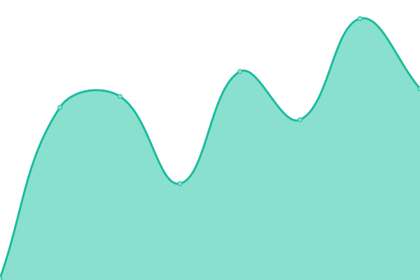
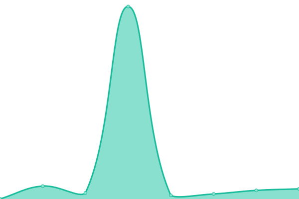
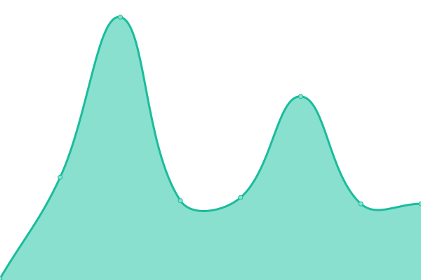
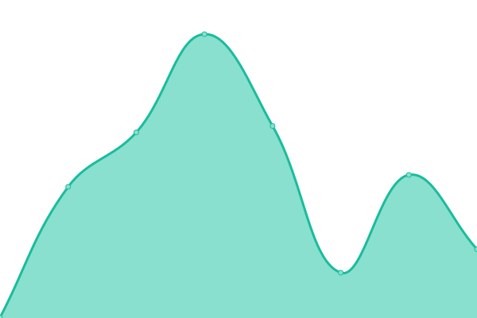

# Welcome to the Frontend Status for the Scratch Website!

I was stupid to rename orgs, and the old url died. now scratchstatus has been renamed to ScratchSuite.

# [📈 Live Status](https://scratchsuite.github.io): <!--live status--> **🟩 All systems operational**

<!--start: status pages-->
<!-- This summary is generated by Upptime (https://github.com/upptime/upptime) -->
<!-- Do not edit this manually, your changes will be overwritten -->
<!-- prettier-ignore -->
| URL | Status | History | Response Time | Uptime |
| --- | ------ | ------- | ------------- | ------ |
|  [Scratch](https://scratch.mit.edu) | 🟩 Up | [scratch.yml](https://github.com/scratchsuite/frontend/commits/HEAD/history/scratch.yml) | 

 203ms
     
 | 

<a href="https://scratchsuite.github.io/frontend/history/scratch">100.00%</a>
    

|  [Scratch - Lab](https://lab.scratch.mit.edu) | 🟩 Up | [scratch-lab.yml](https://github.com/scratchsuite/frontend/commits/HEAD/history/scratch-lab.yml) | 

 153ms
     
 | 

<a href="https://scratchsuite.github.io/frontend/history/scratch-lab">100.00%</a>
    

|  [Scratch - Day](https://day.scratch.mit.edu) | 🟩 Up | [scratch-day.yml](https://github.com/scratchsuite/frontend/commits/HEAD/history/scratch-day.yml) | 

 406ms
     
 | 

<a href="https://scratchsuite.github.io/frontend/history/scratch-day">100.00%</a>
    

|  [Scratch - Forums](https://scratch.mit.edu/discuss) | 🟩 Up | [scratch-forums.yml](https://github.com/scratchsuite/frontend/commits/HEAD/history/scratch-forums.yml) | 

 2083ms
     
 | 

<a href="https://scratchsuite.github.io/frontend/history/scratch-forums">100.00%</a>
    

|  [Scratch - Uploads (Scratch 2)](https://uploads.scratch.mit.edu/) | 🟩 Up | [scratch-uploads-scratch-2.yml](https://github.com/scratchsuite/frontend/commits/HEAD/history/scratch-uploads-scratch-2.yml) | 

 129ms
     
 | 

<a href="https://scratchsuite.github.io/frontend/history/scratch-uploads-scratch-2">100.00%</a>
    

|  [Scratch in Practice](https://sip.scratch.mit.edu/) | 🟩 Up | [scratch-in-practice.yml](https://github.com/scratchsuite/frontend/commits/HEAD/history/scratch-in-practice.yml) | 

 0ms
     
 | 

<a href="https://scratchsuite.github.io/frontend/history/scratch-in-practice">100.00%</a>
    

|  [Scratch - Wiki](https://scratch-wiki.info) | 🟩 Up | [scratch-wiki.yml](https://github.com/scratchsuite/frontend/commits/HEAD/history/scratch-wiki.yml) | 

 930ms
     
 | 

<a href="https://scratchsuite.github.io/frontend/history/scratch-wiki">100.00%</a>
    

|  [Scratch - ScratchJr](https://www.scratchjr.org/) | 🟩 Up | [scratch-scratch-jr.yml](https://github.com/scratchsuite/frontend/commits/HEAD/history/scratch-scratch-jr.yml) | 

 156ms
     
 | 

<a href="https://scratchsuite.github.io/frontend/history/scratch-scratch-jr">100.00%</a>
    

|  [Scratch Foundation](https://www.scratchfoundation.org/) | 🟩 Up | [scratch-foundation.yml](https://github.com/scratchsuite/frontend/commits/HEAD/history/scratch-foundation.yml) | 

 210ms
     
 | 

<a href="https://scratchsuite.github.io/frontend/history/scratch-foundation">100.00%</a>
    

<!--end: status pages-->

[**Visit our status website →**](https://scratchstatus.github.io)

## 📄 License

- Powered by: [Upptime](https://github.com/upptime/upptime)
- Code: [MIT](./LICENSE) © [ScratchStatus](scratchstatus.github.io)
- Data in the `./history` directory: [Open Database License](https://opendatacommons.org/licenses/odbl/1-0/)
